<p align="center">
  
</p>

<p align="center">
  
</p>

### Overview

I'm a generalist engineer. I started in cloud infrastructure, and I now use new technologies, AI in particular, to automate more of the work and create value for the companies I work for. Day to day, I help my teammates adopt better tools and put the right people in touch. I also bring perspective and governance to technical topics, so engineers and management can work from the same picture.

### Stack

<p>
  
  
  
  
  
  
  
  
  
  
  
</p>

### Analytics

<p align="center">
  
  
</p>

<p align="center">
  
</p>

### Logs

```diff
+ open to:      platform engineering, observability, GitOps, AI-assisted ops
+ ask me about: turning 3am pages into 0 pages
- rejected:     YAML indentation debates, Azure infrastructure (if possible :P)
```

<p align="center">
  
</p>
